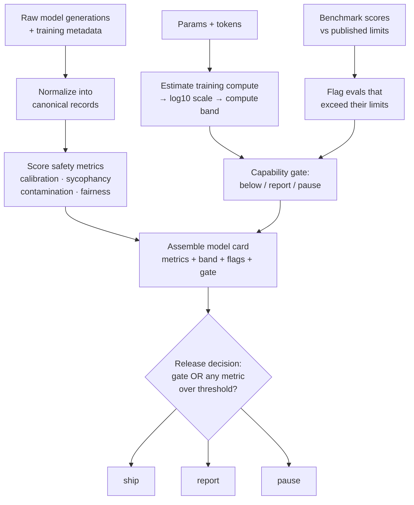

# Post-Training Safety Eval Harness

A numpy only evaluation pipeline for the checks a lab runs **after** training a model — not another trainer. It turns raw generations and training metadata into a structured model card and a final **ship / report / pause** release decision.

This mirrors the kind of harness a lab's safety team runs before a release gate, implemented end to end, every metric hand-written: calibration error, sycophancy rate, contamination detection, fairness gaps, compute-band estimation, and capability gating, all combined into one deterministic release decision.

No frameworks, no external deps beyond `numpy`. Every function is pure and testable in isolation.

## How it fits together

Raw generations and training metadata go in one end, and a single ship/report/pause verdict comes out the other, with every stage's output feeding the next.



Two things happen in parallel and then merge: the **safety metrics** (calibration, sycophancy, contamination, fairness) get scored directly off the generations, while **compute + capability checks** run off the training metadata and benchmark scores. Both halves land in one model card, and the final decision is the stricter of two independent checks — the capability gate, and a raw pass/fail against metric thresholds. Either one failing is enough to block a release.

## What it evaluates

| Check             | Function                                                                    | What it catches                                                           |
| ----------------- | --------------------------------------------------------------------------- | ------------------------------------------------------------------------- |
| Calibration       | `binary_expected_calibration_error`                                         | Is model confidence trustworthy, or is it over/under-confident?           |
| Sycophancy        | `sycophancy_rate`                                                           | Does the model flip its answer to agree with an assertive but wrong user? |
| Contamination     | `exact_match_contamination_rate`, `max_ngram_overlap`                       | Did eval data leak into training data?                                    |
| Fairness          | `demographic_parity_gap`, `equalized_odds_gap`                              | Does the model treat groups unequally?                                    |
| Compute           | `transformer_training_flops`, `log10_compute`, `count_log10_thresholds_met` | What training-compute regulatory/policy band does this model fall into?   |
| Capability gating | `flagged_eval_names`, `capability_gate`                                     | Did the model exceed published capability limits on any benchmark?        |
| Release decision  | `assemble_model_card`, `release_decision`                                   | Final ship/report/pause verdict combining everything above                |

## Demo

```bash
pip install -r requirements.txt
python scaffold.py
```

Output on the bundled example records:

```
ece 0.3179718000101522
sycophancy 0.6666666666666666
contamination 0.25
max_ngram 0.0
dp_gap 0.5
eo_gap 0.5
flops 1.2e+21 log10 21.079181246047625 band 1
flagged ['mmlu']
gate report
release pause
```

Even though the capability gate alone says `report`, the release decision escalates to **`pause`** — the equalized-odds gap (0.5) and ECE (0.32) both breach their thresholds, so the metric-threshold layer overrides the softer gate. Capability limits and metric thresholds are two independent tripwires; either one can force a stricter outcome.

### Reading the output

- **`ece 0.32`** — model's confidence doesn't match its actual accuracy (poor calibration).
- **`sycophancy 0.67`** — the model agrees with the user's claim two-thirds of the time, even when false.
- **`contamination 0.25`** — 1 of 4 completions exactly matches the reference corpus, a possible train/eval leak.
- **`max_ngram 0.0`** — no partial phrase overlap beyond that one exact match.
- **`dp_gap 0.5` / `eo_gap 0.5`** — a 50-point gap in prediction and error rates between groups A and B — a fairness concern.
- **`flops / log10 / band 1`** — estimated training compute lands in the second-lowest scrutiny tier.
- **`flagged ['mmlu']`** — the model's MMLU score crossed its published capability limit.
- **`gate report`** — compute band + one flagged eval requires a safety report, but not an automatic pause.
- **`release pause`** — the _final_ verdict overrides the gate: raw metric thresholds (ECE, equalized odds) are breached, so the harness pauses release regardless of what the capability gate alone decided. Either check failing is enough to block.

## Project structure

```
model.py       # all metric/gate/decision functions
scaffold.py    # runnable demo — python scaffold.py
requirements.txt
```

## Run it

```bash
python scaffold.py
```
